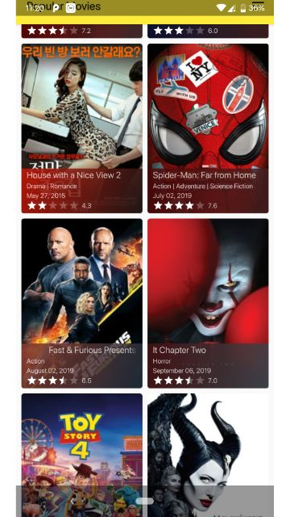
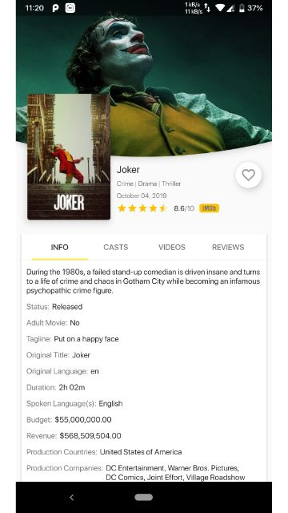
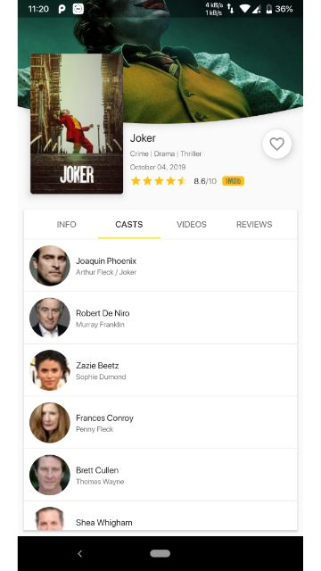
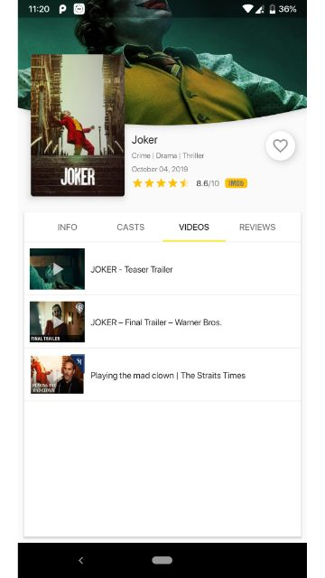
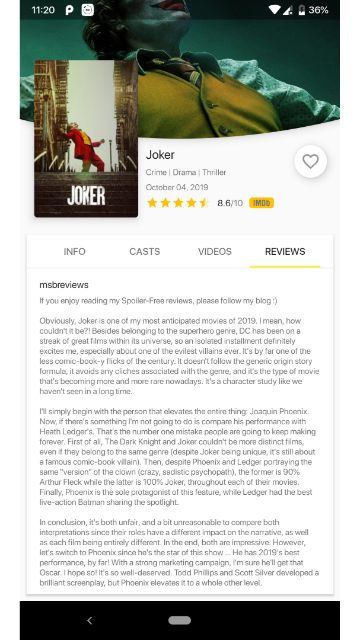

# # \[ 🚧 Work in progress 👷‍♀️⛏👷🔧️👷🔧 🚧 ] **Popular Movies App**

Using this app it easier for movies lovers to find popular, top rated and
upcoming movies and keep up-to-date with the latest movie information.

- Explore movies and see their information in details.
- View movies casts, trailers, videos, read reviews
- Add movies to favourites to get their informations any time.

# Screenshots

Movies List Screen 1           |  Movies List Screen 2
:-------------------------:|:-------------------------:
 | 

Game Detail Screen           |  Game Detail Casts
:-------------------------:|:-------------------------:
 | 

Game Detail Videos            |  Game Detail Reviews
:-------------------------:|:-------------------------:
 | 

# Technologies

- Java
- MVP
- RxJava 2/AutoDispose
- Debugging tooling
  - Leak Canary, Timber, Stetho
- AndroidX/Jetpack
- Glide
- Okio/OkHttp 3/Retrofit 2/Moshi

---

## Use the project with your own The Movie Database(TMDb) API key

* Get you own TMDb API key. See the [get an API key][0].
* Find `.gradle` folder in your home directory, create a file named `gradle.properties` (if not present).

    Usually it can be found at:

        Windows: C:\Users\<Your Username>\.gradle
        Mac: /Users/<Your Username>/.gradle
        Linux: /home/<Your Username>/.gradle

        Inside it there would be a file named gradle.properties (just create it if there isn’t any).

* Open the `gradle.properties` file and paste your API key into the value of the `THE_MOVIE_DB_API_KEY` property, like this

    `THE_MOVIE_DB_API_KEY=PASTE-YOUR-API-KEY-HERE`

* Now you should be able to successfully sync the project.

License
-------
    Copyright (C) 2018 Arpan Sarkar

    Licensed under the Apache License, Version 2.0 (the "License");
    you may not use this file except in compliance with the License.
    You may obtain a copy of the License at

       http://www.apache.org/licenses/LICENSE-2.0

    Unless required by applicable law or agreed to in writing, software
    distributed under the License is distributed on an "AS IS" BASIS,
    WITHOUT WARRANTIES OR CONDITIONS OF ANY KIND, either express or implied.
    See the License for the specific language governing permissions and
    limitations under the License.

[0]: https://www.themoviedb.org/settings/api